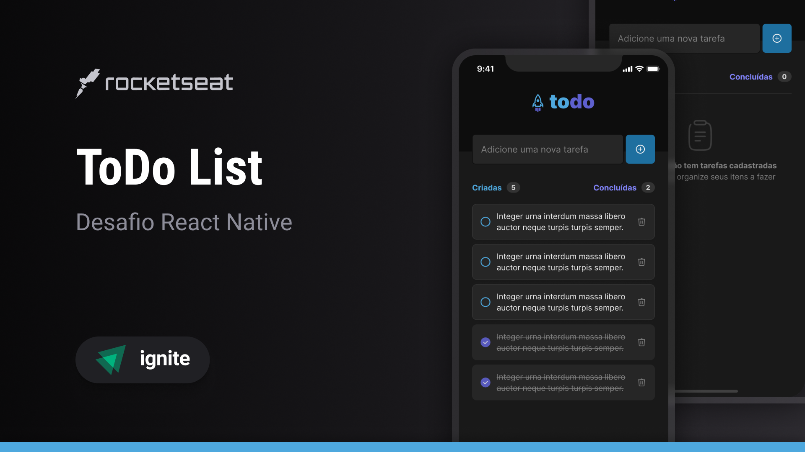

# ToDo App

Este é um aplicativo de gerenciamento de tarefas simples e eficiente desenvolvido em **React Native**. O aplicativo permite que os usuários adicionem, removam e concluam tarefas, proporcionando uma interface amigável e responsiva para o gerenciamento de atividades diárias.

## Funcionalidades

- **Adicionar tarefas**: O usuário pode adicionar novas tarefas com um nome personalizado.
- **Remover tarefas**: É possível remover uma tarefa clicando no ícone de lixeira ao lado da tarefa.
- **Marcar como concluída**: O usuário pode marcar as tarefas como concluídas clicando em um botão de seleção ao lado da tarefa.
- **Contador de progresso**: O aplicativo exibe o número total de tarefas e quantas foram concluídas.

## Tecnologias Utilizadas

- **React Native**: Framework para o desenvolvimento de aplicativos mobile multiplataforma.
- **Expo**: Plataforma que facilita o desenvolvimento com React Native.
- **TypeScript**: Linguagem que adiciona tipagem estática ao JavaScript.
- **Tailwind CSS**: Framework de estilização utilizado com [NativeWind](https://www.nativewind.dev/) para a estilização da interface.
- **uuid**: Biblioteca para gerar IDs únicos para as tarefas.
- **Lucide**: Ícones personalizados usados no aplicativo.

## ToDo App

